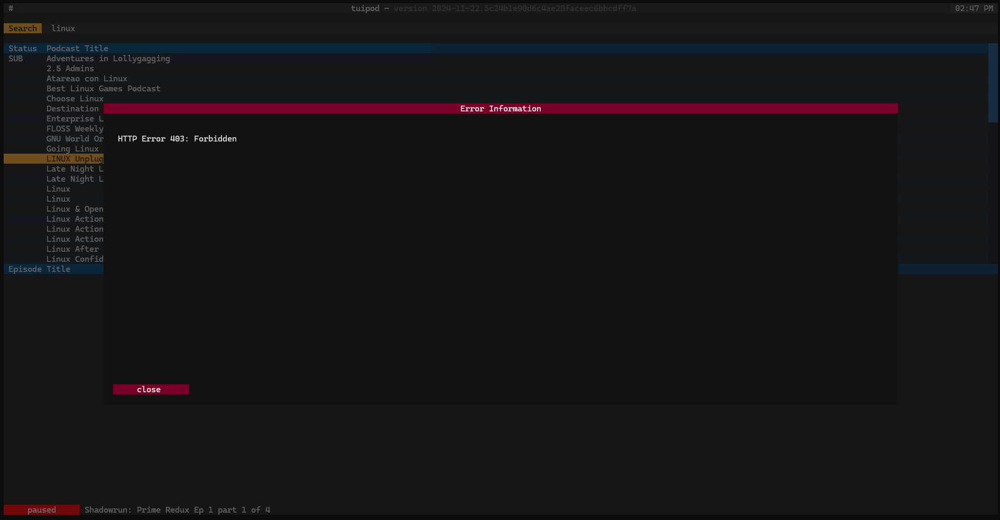
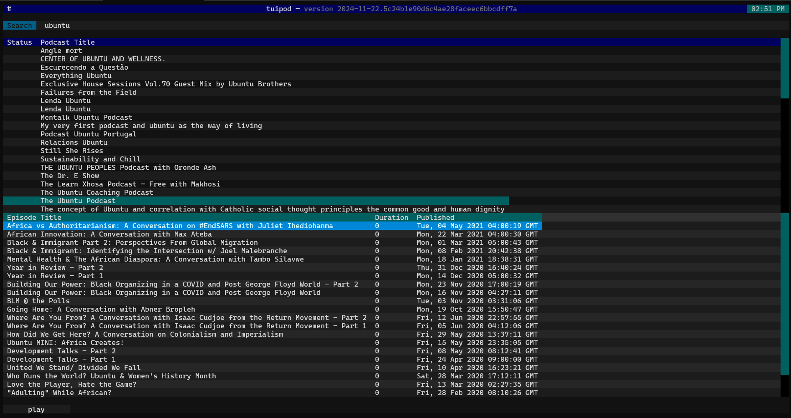

# tuipod

A TUI-based Podcast Player

## Overview

In the never-ending quest to find the "perfect" podcast player, I often try to create my own.

This particular endeavor follows a particularly mediocre experiment using ChatGPT to see how far towards a functional application I could get.

This implementation utilizes Python and Textual -- but no ChatGPT.

## Features

- discover podcasts through iTunes-based search
- play podcast episodes directly from source
- pause podcasts during play
- *more (still in development)*

## Installation and Running

You must:

- have Python installed
- have `pip` installed (if not included with Python)
- Use:
  - a virtual environment 
  - or, install Python modules from your environment (e.g. apt repository) 
  - or, use `--break-system-packages`

*If you are using Windows, you may need the **Visual Studio Build Tools** to build `miniaudio` during the `pip` install.*

```bash
$ git clone https://github.com/mwhickson/tuipod.git
$ pip install -r requirements.txt
$ python -m tuipod
```

Also provided are batch (`tuipod.bat`) and shell (`tuipod.sh`) files to simplify calling `python -m tuipod`.  

## Usage Guide

- type search criteria into the search box and press `ENTER` to fetch and display podcast results
  - if no errors occur and podcast results are found, focus will automatically shift to podcast list
- select a podcast item of interest and press `ENTER` to fetch and display a list of episodes for the selected podcast
  - if no errors occur and episode results are found, focus will automatically shift to the episode list
- select an episode item of interest and press `ENTER` to begin playing the episode
  - if no errors occur, the episode will being playing (the `play` button text will change to `pause` and the button will become green)

### Additional keyboard shortcuts:

- `ESC` will close a modal window
- `F1` will show the About dialog 
- `TAB` and `SHIFT`+`TAB` will move the cursor focus between sections (e.g. search, podcast list, and episode list)
- `CTRL`+`Q` will quit the application
- `CTRL`+`P` will show the textual command palette
- when an episode is selected:
  - `I` will show the episode information
  - `SPACE` will toggle between episode playing/paused state

*NOTE: Some keystrokes depend on application state (e.g. not actively searching, episode playing, etc.)*

## Screenshots




### Linux Screenshot



## Reflection

Having just done something with near feature-parity using ChatGPT, I thought I'd note some thoughts about the differences between the experiment.

During development of tuipod, I purposely did not reference the ChatGPT player code.

- it took longer to put it together manually (not really a surprise)
- given the state of some of the documentation for the projects used, ChatGPT's implementation is, in hindsight, more impressive
- I got what I wanted with the manual approach, and will be able to more easily update and refine what I have, which is not something I can say about the ChatGPT product

Overall, I am much happier with the manual implementation of tuipod.

## License

[MIT License](LICENSE)
