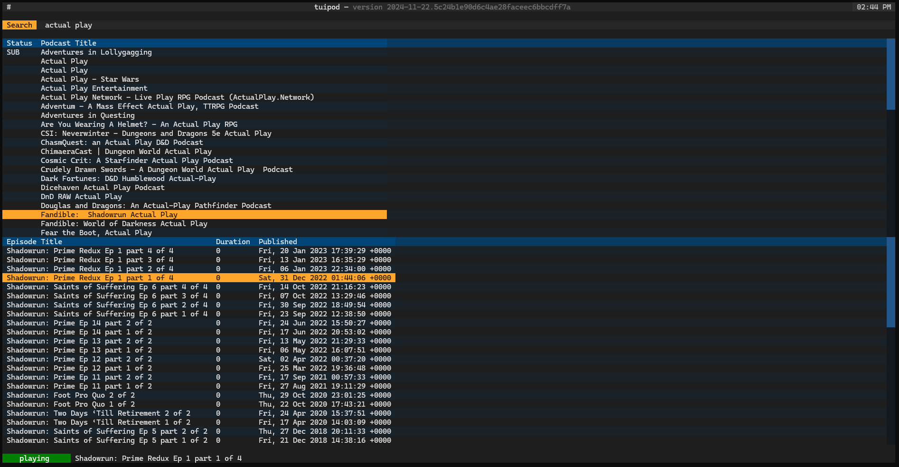

# tuipod

A TUI-based Podcast Player

## Overview

In the neverending quest to find the "perfect" podcast player, I often try to create my own.

This particular endeavor follows a particularly mediocre experiment using ChatGPT to see how far I could get.

## Screenshots

This implementation utilizes Python and Textual -- but no ChatGPT.

## TODO

- improve error handling (still easier to crash than is ideal)
- improve playback handling (pause/seek/display duration + position/history of played episodes)
- add info screen displaying either podcast, or episode detail
- add subscription management (with OPML import and export)
- add episode download option

## Reflection

Having just done something with near feature-parity using ChatGPT, I thought I'd note some thoughts about the differences between the experiment.

During development of tuipod, I purposely did not reference the ChatGPT player code.

- it took longer to put it together manually (not really a surprise)
- given the state of some of the documentation for the projects used, ChatGPT's implementation is, in hindsight, more impressive
- I got what I wanted with the manual approach, and will be able to more easily update and refine what I have, which is not something I can say about the ChatGPT product

Overall, much happier with the manual implementation of tuipod.

## License

[MIT License](LICENSE)
